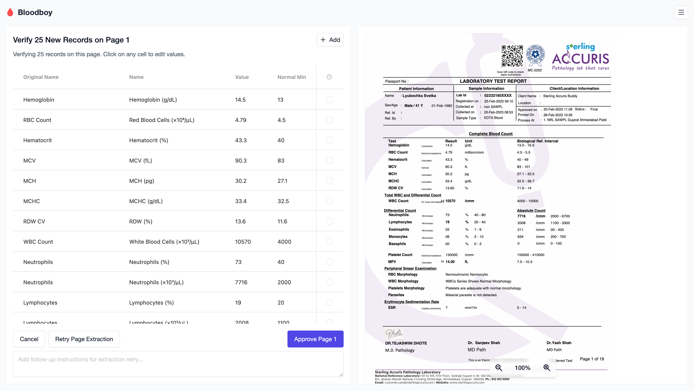
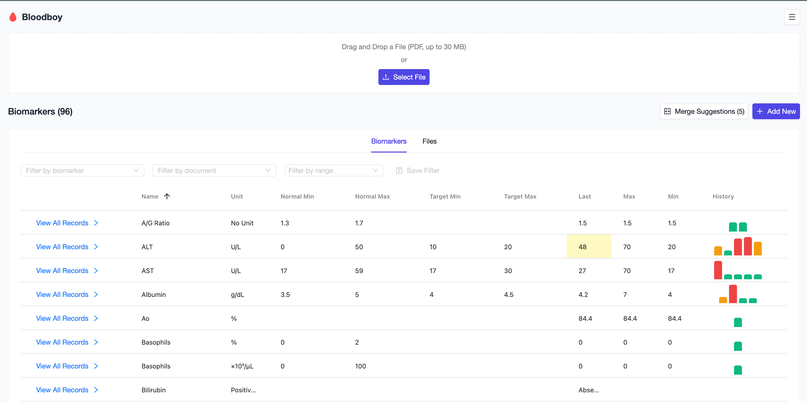
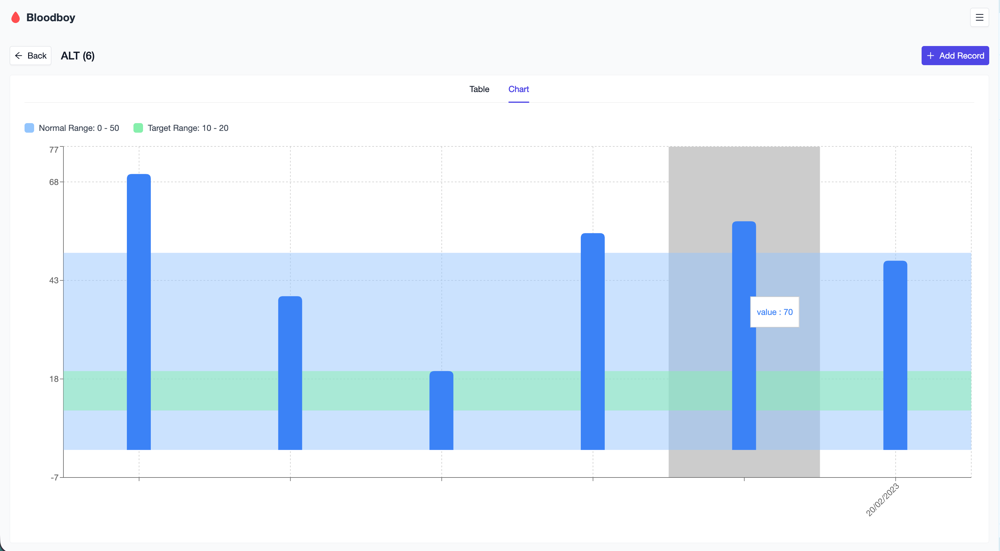

# 🩸👦🏼 Bloodboy

Track and visualize your blood test results over time with AI-powered data extraction

[](./LICENSE)
[](https://www.typescriptlang.org/)
[](https://reactjs.org/)

## 💎 Core Values

- **Privacy First** - Everything stays on your device
- **No Subscriptions** - Free for personal use, forever
- **You Own Your Data**  - Export and backup anytime
- **Any Biomarkers** - Supports extracting and tracking any biomarkers with any units

## ✨ Features

- **PDF Upload** - Drag & drop blood test PDFs for automatic data extraction
- **Built-in PDF Viewer** - View uploaded documents directly in the app 
- **File Organization** - Organize your files and keep them in one place near to extracted values
- **AI-Powered** - OpenAI integration for intelligent biomarker extraction
- **Unit Converter** - Automatic unit conversion
- **Data Visualization** - Interactive charts and trend analysis
- **Anomaly Detection** - Filter biomarkers with strong fluctuations between tests
- **Local Storage** - All data stored locally using IndexedDB
- **Professional Tables** - Sorting, filtering, and inline editing with AG-Grid
- **Saved Filters** - Save and quickly apply custom filter combinations
- **Modern UI** - Clean interface built with AntDesign and Tailwind CSS
- **Import/Export** - Backup and restore your data anytime

## 🖼️ Screenshots

### Upload



### Dashboard



### Charts



## 🚀 Getting Started

### Prerequisites

- Node.js 18+ and npm

### Installation

```bash
npm install
```

### Development

```bash
npm run dev
```

### Build

```bash
npm run build
```

### Scripts

| Command | Description |
|---------|-------------|
| `npm run dev` | Start development server |
| `npm run build` | Build for production |
| `npm run preview` | Preview production build |
| `npm run typecheck` | Run TypeScript type checking |
| `npm run lint` | Run ESLint |
| `npm run lint:fix` | Fix ESLint issues |

## 🛠️ Tech Stack

- **React 19** - UI library
- **TypeScript 5** - Type safety
- **Vite 6** - Build tool
- **Tailwind CSS 3** - Styling
- **AntDesign 5** - UI components
- **AG-Grid 32** - Data tables
- **Dexie** - IndexedDB wrapper
- **OpenAI** - PDF parsing

## 📁 Project Structure

```
src/
├── components/    # Reusable UI components
├── pages/        # Page components
├── db/           # Database models and services
│   ├── models/   # Data models
│   ├── services/ # Dexie instance
│   └── hooks/    # Database hooks
├── constants/    # App constants
├── types/        # TypeScript types
├── utils/        # Helper functions
├── openai/       # OpenAI integration
└── App.tsx       # Root component
```

## 🔧 Configuration

See `.env.example` for optional environment variables. The app works fully offline without any configuration.

## 🤝 Contributing

Contributions are welcome! Please feel free to submit a Pull Request.

## 📧 Contact

For questions or feedback, reach out at [yashugaev@gmail.com](mailto:yashugaev@gmail.com)

## 📄 License

MIT License with Commons Clause - see the [LICENSE](LICENSE) file for details.

---

<p align="center">Made with ❤️ and 🩸 for better health tracking</p>
